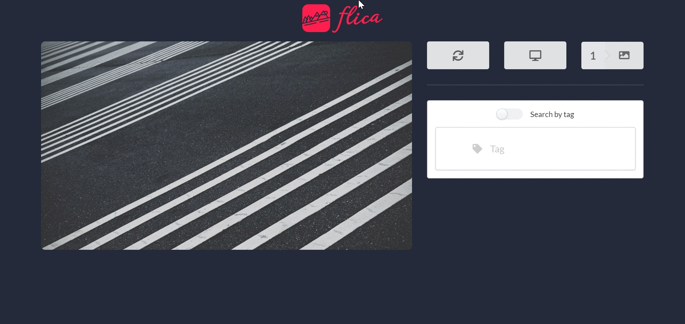

# Flica

> A web application built using React, Semantic UI & Unsplash Image API.

> Access at: https://sleepy-joliot-a28cc4.netlify.com
---

## Features

- Progressive web application (PWA).
- Image metadata fetch from [Unsplash Image API](https://unsplash.com/developers)
- Ability to switch between `mobile` & `desktop` aspect ratios.
- Traversed wallpaper gallery.
- Quick image download.
- Search by tag.

## Usage 

***DEFAULT (WITHOUT TAGS)***

Using the `Next` button fetches a random wallpaper using Unsplash's image API. Each wallpaper is saved to the gallery for retrieving later on.

***USING TAGS***

- By enabling `Search by tag`, the text field can be used to specify certain elements of a requested wallpaper.
---

## Contributing

> To get started...

### Step 1

- **Option 1**
    - 🍴 Fork this repo!

- **Option 2**
    - 👯 Clone this repo to your local machine using `https://github.com/ordoven/Flica.git`

### Step 2

- ### `npm start` or `yarn start`

  - Runs app in development mode. 
Open [http://localhost:3000](http://localhost:3000) to view it in the browser.

- ### `npm run build` or `yarn build`

  - Builds the app to the `build` folder. 

The app is ready to be deployed.

### Step 3

- 🔃 Create a new pull request

---

## Support

Reach out to me at one of the following places!

- Email at <a href="mailto:tadasknieza@gmail.com" target="_top">`tadasknieza@gmail.com`</a>
- Twitter at <a href="http://twitter.com/tadasknieza" target="_blank">`@tadasknieza`</a>

---

## License

- **[MIT license](http://opensource.org/licenses/mit-license.php)**
